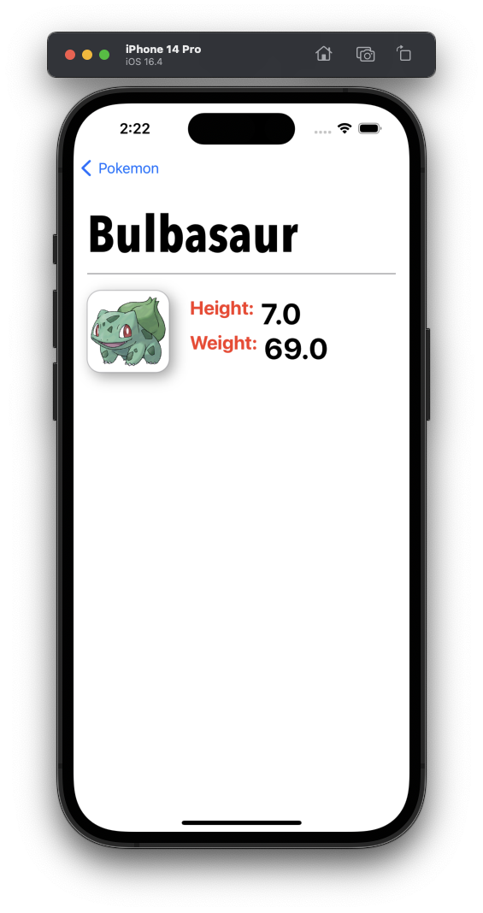

## CatchEmAll

- Build an app using the public pokeapi.co api which will gather information on over 1,100 Pokemon. 
- Make API calls, parse JSON, populate an app, and make an additional API call to get more data and even an image of the creature. 
- The skills learned here can be applied in many other API call/JSON parsing contexts.

## Screenshots

  
  
  

#### By John Gallaugher
https://bit.ly/prof-g-swiftui
